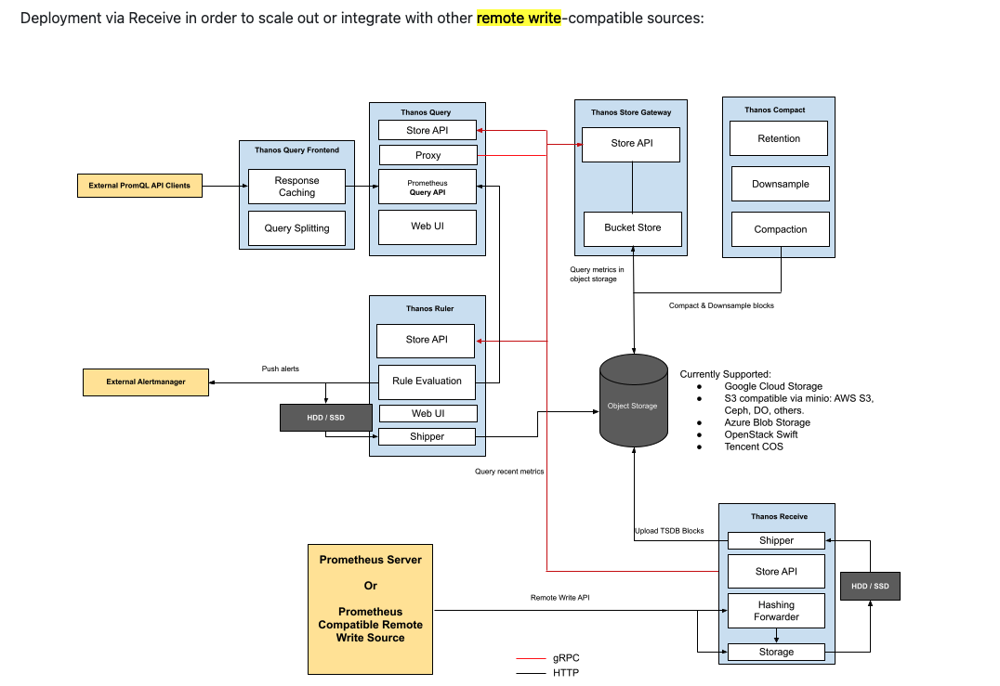

# Thanos deployment using kube-thanos

## thanos remote-write
- all managed services for Prometheus from AWS and GCP use the remote-write protocol
- in theory switching from Thanos to a managed service should be a simple as swapping out one URL
- Prometheus natively supports the remote write protocol
- Thanos remote-write supports mTLS, which lets only authorized Prometheus instances push data to our Thanos
- For data older than 15 days, the query will go thru the `storage gateway`
## thanos reference diagram
- 

```
                 +
Tenant's Premise | Provider Premise
                 |
                 |            +------------------------+
                 |            |                        |
                 |  +-------->+     Object Storage     |
                 |  |         |                        |
                 |  |         +-----------+------------+
                 |  |                     ^
                 |  | S3 API              | S3 API
                 |  |                     |
                 |  |         +-----------+------------+
                 |  |         |                        |       Store API
                 |  |         |  Thanos Store Gateway  +<-----------------------+
                 |  |         |                        |                        |
                 |  |         +------------------------+                        |
                 |  |                                                           |
                 |  +---------------------+                                     |
                 |                        |                                     |
+--------------+ |            +-----------+------------+              +---------+--------+
|              | | Remote     |                        |  Store API   |                  |
|  Prometheus  +------------->+     Thanos Receiver    +<-------------+  Thanos Querier  |
|              | | Write      |                        |              |                  |
+--------------+ |            +------------------------+              +---------+--------+
                 |                                                              ^
                 |                                                              |
+--------------+ |                                                              |
|              | |                PromQL                                        |
|    User      +----------------------------------------------------------------+
|              | |
+--------------+ |
                 +
```

## what is jasonnet?
### Superset of JSON: Jsonnet is a data templating language that is a strict superset of JSON
- `Jsonnet` is a configuration language that helps to define and generate JSON data. 
- It's especially useful in the cloud-native and Kubernetes world, where configuration files, particularly in YAML or JSON format, can proliferate rapidly and become difficult to manage due to their sheer volume and redundancy.
- *any valid JSON document is also a valid Jsonnet program*
#### Variables & Logic: 
- Unlike plain JSON, Jsonnet lets you use variables, conditionals, and even loops. 
- This allows for the creation of more dynamic and parameterized configuration files.
#### Functions: 
- You can define functions in Jsonnet, which can be reused across different parts of your configuration
### Mixins and Imports: 
- Jsonnet supports importing other Jsonnet or JSON files, allowing for modular configurations and code reusability.

### jasonnet package manager:  jsonnet-bundler
- aka "jb
- The behavior of the go get command outside of a Go module has changed
- 
- installation: `go install github.com/jsonnet-bundler/jsonnet-bundler/cmd/jb@latest`
- `which jb`

## kube-thanos: Jsonnet based Kubernetes templates
### design
- tree:

```
❯ tree
.
├── thanos-query-deployment.yaml
├── thanos-query-service.yaml
├── thanos-query-serviceAccount.yaml
├── thanos-query-serviceMonitor.yaml
├── thanos-receive-ingestor-default-service.yaml
├── thanos-receive-ingestor-default-statefulSet.yaml
├── thanos-receive-ingestor-serviceAccount.yaml
├── thanos-receive-ingestor-serviceMonitor.yaml
├── thanos-receive-router-configmap.yaml
├── thanos-receive-router-deployment.yaml
├── thanos-receive-router-service.yaml
├── thanos-receive-router-serviceAccount.yaml
├── thanos-store-service.yaml
├── thanos-store-serviceAccount.yaml
├── thanos-store-serviceMonitor.yaml
└── thanos-store-statefulSet.yaml
```
- With IRSA (IAM Roles for Service Accounts), you avoid hardcoding any access or secret keys. Instead, the service account your pods run as is associated with an IAM role via the OIDC provider, and they automatically receive temporary credentials for that IAM role.
- In the context of Thanos and the thanos.yaml configuration file, this means you'll only need to specify the bucket and endpoint. 
- The access and secret keys will be automatically sourced by the SDK inside the Thanos application from the IAM Role attached to the Kubernetes service account, thanks to the IRSA setup.


### example.jsonnet
-`local t = import 'kube-thanos/thanos.libsonnet';`
  + This line imports the kube-thanos library and assigns it to the variable t. 
  + All the components of the library can then be accessed through this variable.
- "Common Configuration"
 + The commonConfig object holds configurations that will be common across different Thanos components. 
 + This allows for a DRY (Don't Repeat Yourself) setup
- `local i = t.receiveIngestor(commonConfig.config {...});`
  + Here, the Receive Ingestor component of Thanos is configured using the common configurations and some additional specifics like replication factor and service monitor.
- "Receive Router Configuration:"
  + Similarly, the r variable sets up the Receive Router component.
- Generating Kubernetes Objects:
  + The last section with multiple {...} + {...} is essentially constructing the final set of Kubernetes objects. 
  + It uses list comprehension to dynamically generate objects based on what's defined in s, q, r, and i.
- For example, { ['thanos-store-' + name]: s[name] for name in std.objectFields(s) } will iterate over all fields of s (which represents the Store component) and create new objects with keys like thanos-store-<name>.
- output
  + The output will be a set of Kubernetes manifests for deploying Thanos components in the desired configuration. 
  + This Jsonnet script will need to be evaluated to produce the YAML configuration that Kubernetes can understand. 
  + The usual flow is to use jsonnet to evaluate the Jsonnet file and then optionally gojsontoyaml to convert the resulting JSON to YAML.
- `jsonnet -J vendor example.jsonnet | gojsontoyaml > thanos.yaml`
  + Where vendor is a directory containing all dependencies (usually set up by jb) and example.jsonnet is your Jsonnet script. 
  + The output thanos.yaml will contain the Kubernetes configurations ready to be applied with kubectl.

#### objectStorageConfig
- This is crucial. 
- It points to a Kubernetes Secret that holds the configuration for accessing your object storage (like S3). 
- You'll have to ensure such a Secret exists in the specified namespace and contains the correct configuration (thanos.yaml key in this example).
#### volumeClaimTemplate
- Adjust the storage requests based on your cluster's storage capabilities and your data retention needs
#### Component-specific Configurations: 
- Each of the components (i, r, s, q in the script) might need adjustments based on your setup:

  + replicas: 
    - Depending on your fault tolerance and scalability requirements, you might want to adjust the replica count.
  + replicaLabels: T
    - hese are used to ensure data consistency. 
    - If you're customizing replication settings, make sure these are adjusted accordingly.
  + objectStorageConfig: 
    - If you want certain components to push to or pull from object storage, ensure this is configured correctly.
  + serviceMonitor: 
    - If you're not using the Prometheus Operator or have a different setup for monitoring, you might adjust this setting.
#### Endpoints & Stores: 
- Ensure that components like the Query component (q) have the correct endpoints configured. 
- *In this script, it is set to consider both the Store and the Receive Ingestor as data sources*
#### Storage & Persistence: 
- Ensure that the PVC templates (volumeClaimTemplate) match your cluster's storage classes and your requirements for data persistence.


### installation
- `cd kube-thanos`
- `jb init`
- `cat jsonnetfile.json`  (creates the initial/empty jsonnetfile )
```
{
  "version": 1,
  "dependencies": [],
  "legacyImports": true
}
```
- `jb install github.com/thanos-io/kube-thanos/jsonnet/kube-thanos@main`
- `jb update`
- `go install github.com/brancz/gojsontoyaml@latest`
- After running this, the gojsontoyaml binary will be installed in your $GOPATH/bin directory
- `pwd`
/Users/robert/go/src/github.com/gd9-infrastructure/kube-thanos
- `./build.sh example.jsonnet`
- $ `kubectl apply -f manifests/`
```
❯ kubectl apply -f manifests/
deployment.apps/thanos-query created
service/thanos-query created
serviceaccount/thanos-query created
servicemonitor.monitoring.coreos.com/thanos-query created
service/thanos-receive-ingestor-default created
statefulset.apps/thanos-receive-ingestor-default created
serviceaccount/thanos-receive-ingestor created
servicemonitor.monitoring.coreos.com/thanos-receive-ingestor created
configmap/hashring-config created
deployment.apps/thanos-receive-router created
service/thanos-receive-router created
serviceaccount/thanos-receive-router created
service/thanos-store created
serviceaccount/thanos-store created
servicemonitor.monitoring.coreos.com/thanos-store created
statefulset.apps/thanos-store created
```
## links
- https://github.com/thanos-io/kube-thanos
- Anton: https://www.youtube.com/watch?v=feHSU0BMcco&t=12s
- https://thanos.io/
- https://github.com/dsayan154/thanos-receiver-demo
- https://aws.amazon.com/blogs/opensource/improving-ha-and-long-term-storage-for-prometheus-using-thanos-on-eks-with-s3/
- https://docs.aws.amazon.com/eks/latest/userguide/service-accounts.html

